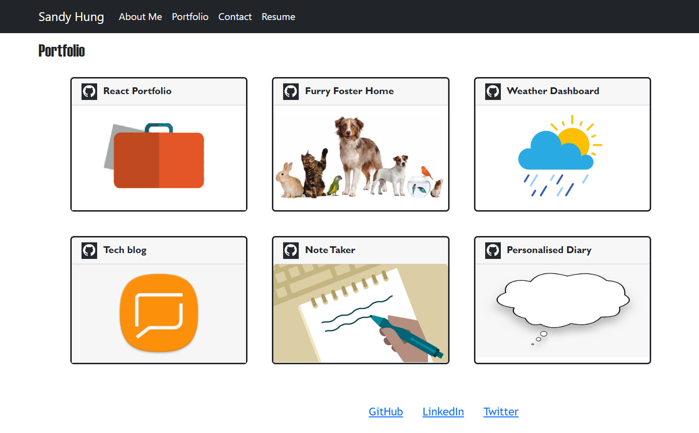

# Sandy's React Portfolio
  
  ## Description
  This is my personal portfolio webpage created using my newly learnt React skills. The webpage showcases projects that I've worked on, both as solo or in a group. This is a place where I can share my work with other developers and collaborate on other works. . 
  Below is a screenshot of the deployed webpage:
  

  ## Table of Contents
  - [Description](#description)
  - [Usage](#usage)
  - [Technology](#technology)
  - [Roadmap](#roadmap)
  - [Contributing](#contributing)
 
  ## Usage
  On the homepage, you will be directed to the About Me section where you can find a brief biography about myself. The navigation bar contains options for Portfolio, Contact, and Resume. 
  Clicking on the option will render the corresponding section without reloading the page. You can see a list of my projects I've worked on under the Portfolio section. Clicking on the image of the portfolio will take you to the deployed website. If you'd like to view the code, the Git Hub icon will take you to the corresponding Git Hub repository. You can contact me via the contact section - please enter all fields to send me a message. The resume section contains a brief overview of my proficiencies, and you can also download a copy of my resume via the embedded link.
 Check out the deployed application via the link: https://sandy5433.github.io/Sandys-react-portfolio/
  ## Technology
  React is used in this application to create the interactive UIs. Bootstrap has been used for the Portfolio and Header components of the webpage  
  ## Roadmap
  I am working on adding new features and functions to the web application. The footer currently only links to my GitHub page as I am working on building my LinkedIn and Twitter account. The resume link is also pending to be updated. Contact me form is not yet functional, however, this function will be implemented as I progress through my coding bootcamp. 
  
  ## Contributing
  If you would like to contribute or collaborate with me on this project, head to my GitHub page at https://github.com/Sandy5433/Sandys-react-portfolio.git to see details of the application code. If you have any comments or feedback, please reach out to me via my email sandyhung83@yahoo.com.tw  
